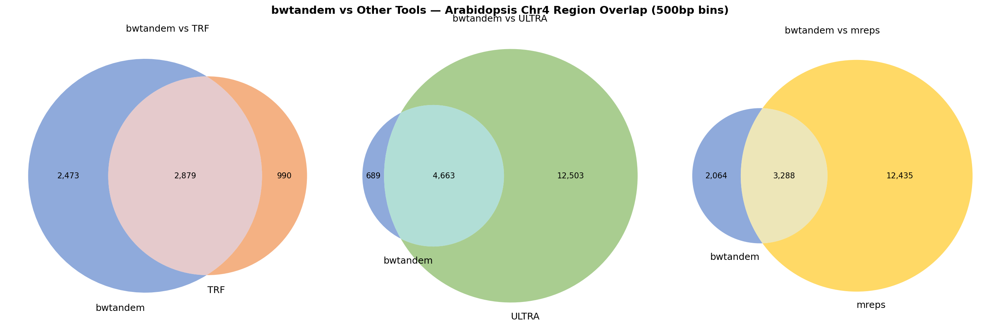

# BWT-based Tandem Repeat Finder

## How BWT Finds Tandem Repeats


## Project Overview

BWT Tandem Repeat Finder is a tool for detecting tandem repeats in genomic FASTA files. It uses the Burrows-Wheeler Transform (BWT) and FM-index as its core algorithms, and comprehensively detects everything from short perfect repeats (STR/microsatellites) to ultra-long repeats spanning hundreds of kilobases through a 3-tier pipeline.

### Why is this tool needed?

Tandem repeats play important roles in genome instability, genetic disorders, and evolutionary research. Existing tools (such as TRF) have limitations in detecting long repeats or imperfect repeats. This tool has the following characteristics:

- **FM-index-based fast search**: Efficiently processes large chromosome sequences using suffix arrays and BWT
- **3-Tier pipeline**: Achieves both detection rate and speed through a 3-stage detection structure optimized for each repeat type
- **Multiple output formats**: Supports BED, VCF, TRF `.dat`, and STRfinder `.csv`
- **Adaptive parameters**: Automatically adjusts Tier 3 parameters based on sequence length, GC content, and coverage
- **Optional acceleration**: Enables acceleration of core operations through Cython extensions and Numba JIT compilation

---

## Installation

### Micromamba Environment Setup (Recommended)

Using [Micromamba](https://mamba.readthedocs.io/en/latest/user_guide/micromamba.html), you can manage all dependencies in an isolated environment.

```bash
# 1. Create environment (Python 3.11 + main dependencies)
micromamba create -n bwtandem python=3.11 numpy cython pytest numba setuptools -c conda-forge -y

# 2. Install pydivsufsort (not on conda-forge, so install via pip; --no-build-isolation required)
micromamba run -n bwtandem pip install pydivsufsort --no-build-isolation

# 3. Build Cython extensions (requires -std=c99 on GCC 4.x environments)
micromamba run -n bwtandem python3 -c "
from setuptools import setup, Extension
from Cython.Build import cythonize
import numpy as np
ext_modules = [Extension('src._accelerators', ['src/_accelerators.pyx'],
               include_dirs=[np.get_include()], extra_compile_args=['-std=c99'])]
setup(script_args=['build_ext', '--inplace'],
      ext_modules=cythonize(ext_modules, compiler_directives={'language_level': '3'}))
"

# 4. Run tests
micromamba run -n bwtandem python3 -m pytest tests/ -v

# 5. Run the tool
micromamba run -n bwtandem python3 -m src.main input.fa --format bed -v
```

### Direct Python Dependency Installation

You can also install dependencies directly without Micromamba.

```bash
# Required dependencies
pip install numpy pydivsufsort

# Optional dependencies (performance improvement)
pip install numba Cython
```

| Package | Type | Description |
|---------|------|-------------|
| `numpy` | Required | Array operations |
| `pydivsufsort` | Required (recommended) | Fast suffix array construction; falls back to NumPy prefix-doubling if unavailable |
| `numba` | Optional | JIT acceleration for rank queries and LCP computation |
| `Cython` | Optional | Compiling `_accelerators.pyx` to accelerate critical paths |

### Building Cython Extensions

`_accelerators.pyx` provides performance-critical paths including Hamming distance computation, mismatch extension, LCP candidate detection, and DP alignment. Without compilation, pure-Python fallbacks are used, and some code paths return empty results.

```bash
# Run from the project root
python3 -c "
from setuptools import setup, Extension
from Cython.Build import cythonize
import numpy as np
ext_modules = [Extension('src._accelerators', ['src/_accelerators.pyx'], include_dirs=[np.get_include()])]
setup(script_args=['build_ext', '--inplace'], ext_modules=cythonize(ext_modules, compiler_directives={'language_level': '3'}))
"
```

On successful build, a `src/_accelerators.*.so` file will be generated.

### Singularity Container

You can build a container that includes all dependencies and Cython extensions.

```bash
# Build container (requires admin privileges)
sudo singularity build bwtandem.sif Singularity

# Run with the container
singularity exec bwtandem.sif python3 -m src.main input.fa --format bed
```

The container image is based on Ubuntu 22.04 with numpy, numba, pydivsufsort, and Cython pre-installed.

---

## Quick Start

```bash
# Most basic execution (defaults: all Tiers, BED output)
python3 -m src.main input.fa

# View results
cat input.bed
```

The above command generates an `input.bed` file. The BED format includes columns for `chrom`, `start`, `end`, `motif`, `copies`, `tier`, `mismatch_rate`, and `strand`.

---

## CLI Options in Detail

```
python3 -m src.main <fasta_file> [options]
```

| Option | Default | Description |
|--------|---------|-------------|
| `fasta_file` | (required) | Path to input FASTA file |
| `--min-period INT` | `1` | Minimum repeat unit length to detect (bp) |
| `--max-period INT` | `2000` | Maximum repeat unit length to detect (bp) |
| `--min-array-bp INT` | None | Minimum repeat array length filter for results (bp) |
| `--max-array-bp INT` | None | Maximum repeat array length filter for results (bp) |
| `--tiers TIERS` | `tier1,tier2,tier3` | List of Tiers to run (comma-separated, or `all`) |
| `--tier3-mode MODE` | `balanced` | Tier 3 speed/accuracy preset: `fast`, `balanced`, `sensitive` |
| `--format FORMAT` | `bed` | Output format: `bed`, `vcf`, `trf`, `strfinder` |
| `-o, --output PREFIX` | Input filename | Output file prefix |
| `-t, --threads INT` | `1` | Number of parallel processes (parallel processing per chromosome) |
| `--mask MODE` | `none` | Masking mode: `none`, `soft`, `hard`, `both` |
| `-v, --verbose` | `False` | Print progress information |
| `--profile` | `False` | Profile execution time with cProfile and output top hotspots |

### Detailed Option Descriptions

**`--min-period` / `--max-period`**
Specifies the length range of repeat units (motifs). Tier 1 handles 1-9 bp, Tier 2 handles 10 bp and above, and Tier 3 handles 100 bp and above, so setting `--max-period 100` will limit the effectiveness of Tier 3.

**`--min-array-bp` / `--max-array-bp`**
Filters results based on the total repeat array length (repeat unit x copy number). Example: `--min-array-bp 30` removes short arrays less than 30 bp.

**`--tiers`**
Used to run only specific Tiers. You can combine `tier1`, `tier2`, `tier3`, or `all`.

**`--tier3-mode`**
- `fast`: Large k-mer size, wide stride for fast scanning (reduced sensitivity)
- `balanced`: Default, balances speed and accuracy
- `sensitive`: Small k-mer size, narrow stride for detailed scanning (reduced speed)

**`-t, --threads`**
Processes multiple chromosomes simultaneously using multiple processes. Since each chromosome independently builds a BWT index and detects repeat sequences, linear speedup can be expected with multi-chromosome FASTA files. Has no effect on single-chromosome files.

```bash
# Parallel processing with 4 processes
python3 -m src.main genome.fa -t 4 -v

# Set to match the number of CPU cores (using nproc)
python3 -m src.main genome.fa -t $(nproc) -v
```

**`--mask`**
Specifies how to handle soft mask (lowercase) and hard mask (N) regions in genomic FASTA files.

| Mode | Lowercase (acgt) | N characters | Description |
|------|-------------------|--------------|-------------|
| `none` | Convert to uppercase | Keep | Default: ignore masks, analyze all sequences |
| `soft` | Replace with N | Keep | Skip soft-masked regions (repetitive elements, etc.) |
| `hard` | Convert to uppercase | Keep | Skip only hard-masked regions (gaps, unspecified regions) |
| `both` | Replace with N | Keep | Skip both soft and hard masked regions |

Soft masking follows the convention where tools like RepeatMasker mark repetitive elements (LINE, SINE, transposons, etc.) in lowercase. Use `--mask soft` when you want to analyze only tandem repeats while excluding known interspersed repeats.

```bash
# Analyze excluding soft-masked regions
python3 -m src.main masked_genome.fa --mask soft -v

# Exclude both soft and hard masked regions
python3 -m src.main masked_genome.fa --mask both -v
```

---

## 3-Tier Detection Pipeline

The `TandemRepeatFinder` coordinator builds a `BWTCore` FM-index once per chromosome, then runs the enabled Tiers sequentially. Each Tier receives information about regions already detected by previous Tiers to avoid redundant work.

```
Input FASTA
    |
    v
BWTCore FM-index construction (suffix array, BWT, occurrence array)
    |
    +---> Tier 1: Short perfect repeats (1-9 bp)
    |       |
    +---> Tier 2: Medium/imperfect repeats (>=10 bp)
    |       |   [Excluding Tier 1 result regions]
    |
    +---> Tier 3: Long repeats (100 bp - 100 kbp)
    |       [Excluding Tier 1 + Tier 2 result regions]
    |
    v
Post-processing: Sort -> Merge adjacent -> Filter overlaps -> Filter by length
    |
    v
Output (BED / VCF / TRF / STRfinder)
```

### Tier 1: Short Perfect Repeats (1-9 bp)

**Coverage**: Motif length 1-9 bp, perfect (or near-perfect) repeats with 3 or more copies.

**How it works**:
- Sequence length < 10 Mbp: Enumerates all canonical motifs via FM-index backward search and finds tandem repeat positions.
- Sequence length >= 10 Mbp: Switches to a sliding window scanner with adaptive step size.

This is the primary detection tier for STRs (Short Tandem Repeats, microsatellites). It performs O(1) short k-mer lookup using an 8-mer hash.

### Tier 2: Medium/Imperfect Repeats (>=10 bp)

**Coverage**: Repeats with motif length 10 bp or longer. Detects minisatellites and medium-length imperfect repeats.

**Two sub-phases**:

1. **Long-unit strict** (unit >=20 bp): Computes periods from adjacent suffix pairs in the LCP array built using Kasai's algorithm, and extends with mismatch tolerance.

2. **General scanning** (unit 10-50 bp): Uses BWT k-mer seed scanning (`bwt_seed.py`) to detect periodic runs (arithmetic progressions) in FM-index occurrence positions and extends candidates.

Allows up to 20% mismatches and 10% indels.

### Tier 3: Long Repeats (100 bp - 100 kbp)

**Coverage**: Repeat units 100 bp-100,000 bp. Detects satellite DNA, centromeric repeats, transposon-derived repeats, etc.

**How it works**:
- BWT k-mer seed scanning (large k-mers, sparse stride=100 by default)
- Detects arithmetic progressions in occurrence positions, then determines candidate regions
- **Ultra-long arrays** (>100 copies or >10 kb): Saves full DP alignment costs via anchor-based boundary verification (`anchor_scan_boundaries`)
- **Regular arrays**: Determines precise boundaries via full DP alignment (`refine_repeat`)

**Adaptive parameters**: Automatically computes k-mer size, stride, max_occurrences, etc., based on sequence length, GC content, and previously-detected coverage ratio (see section below).

---

## Output Formats

### BED Format (Default)

Tab-delimited 8-column format. Coordinates are 0-based (BED standard).

```
chr1    100    145    AT    22.5    1    0.022    +
chr1    500    620    AATGG    24.0    2    0.083    +
chr1    1000   5400   ATCGATCG    550.0    3    0.150    -
```

| Column | Description |
|--------|-------------|
| 1 chrom | Chromosome name |
| 2 start | Start position (0-based) |
| 3 end | End position |
| 4 motif | Repeat unit sequence |
| 5 copies | Copy number |
| 6 tier | Detection Tier (1/2/3) |
| 7 mismatch_rate | Mismatch rate (0.0-1.0) |
| 8 strand | Strand (+/-) |

### VCF Format

VCFv4.2 format. Coordinates are 1-based (VCF standard). INFO field includes MOTIF, COPIES, TIER, etc.

```
##fileformat=VCFv4.2
##INFO=<ID=END,Number=1,Type=Integer,Description="End position of the repeat">
#CHROM  POS   ID  REF  ALT   QUAL  FILTER  INFO
chr1    101   .   A    <STR>  .     .       END=145;MOTIF=AT;CONS_MOTIF=AT;COPIES=22.5;TIER=1;CONF=0.98;MM_RATE=0.022;...
```

### TRF .dat Format

A format compatible with TRF (Tandem Repeats Finder). Space-delimited.

```
100 145 2 22.5 2 97 0 44 22 39 30 9 1.85 AT ATATATATATATATATATATAT...
```

Column order: `Start End Period CopyNumber ConsensusSize PercentMatches PercentIndels Score A C G T Entropy ConsensusPattern Sequence`

### STRfinder .csv Format

A CSV format compatible with the STRfinder tool. Coordinates are 1-based.

```csv
STR_marker,STR_position,STR_motif,STR_genotype_structure,STR_genotype,STR_core_seq,Allele_coverage,Alleles_ratio,Reads_Distribution,STR_depth,Full_seq,Variations
STR_chr1_100,chr1:101-145,[AT]n,2[AT]22,22,ATATATATAT...,97%,-,22:22,22,ATATATATAT...,-
```

---

## Tier 3 Adaptive Parameters

Tier 3 automatically adjusts search parameters based on input characteristics through the `compute_adaptive_params()` function.

### Relationship Between Input Characteristics and Parameters

| Input Characteristic | Affected Parameters | Effect |
|---------------------|---------------------|--------|
| Sequence length (seq_len) | `kmer_size`, `stride`, `max_occurrences`, `scan_backward`, `scan_forward` | Longer sequence = larger k-mer, larger stride |
| GC content (gc_content) | `allowed_mismatch_rate` | Farther from 0.5 = higher mismatch tolerance |
| Previously-detected coverage ratio (coverage_ratio) | `stride`, `anchor_match_pct` | Higher coverage = smaller stride (more detailed) |
| Maximum period (max_period) | `tolerance_ratio` | Longer period = greater tolerance |

### Parameter Details

| Parameter | Range | Description |
|-----------|-------|-------------|
| `kmer_size` | 12-28 | FM-index seed k-mer length. Longer = higher specificity |
| `stride` | 20-300 | k-mer sampling interval. Larger = faster but lower sensitivity |
| `allowed_mismatch_rate` | 0.15-0.20 | Allowed mismatch ratio |
| `tolerance_ratio` | 0.02-0.04 | Period estimation error tolerance ratio |
| `max_occurrences` | 200-1500 | Maximum k-mer occurrence count (excludes frequent k-mers) |
| `anchor_match_pct` | 0.70-0.80 | Minimum match percentage for anchor-based boundary verification |
| `scan_backward` | 20-80 | Number of periods to scan backward from anchor |
| `scan_forward` | 200-800 | Number of periods to scan forward from anchor |

### Preset Descriptions

The `--tier3-mode` option proportionally adjusts speed-related parameters through speed_factor.

| Preset | speed_weight | Characteristics |
|--------|-------------|-----------------|
| `fast` | 0.8 | Increased k-mer size, increased stride, decreased max_occurrences. Suitable for fast screening of large genomes |
| `balanced` | 0.5 | Default. Balances speed and sensitivity |
| `sensitive` | 0.2 | Decreased k-mer size, decreased stride, increased max_occurrences. Suitable for short sequences or detailed analysis |

### Special Handling by Sequence Length

- **Over 100 Mbp (large chromosome mode)**: Forced adjustment to `stride >= 150`, `kmer_size >= 20`, `max_occurrences <= 500`
- **Under 100 kbp (small sequence mode)**: Minimum sensitivity guaranteed with `stride >= 20`, `kmer_size >= 12`

---

## Usage Examples

### Example 1: Basic Execution

```bash
# Run all Tiers, BED output (default)
python3 -m src.main arabadopsis_chrs/chr1.fa -v

# Output: chr1.bed
```

### Example 2: Running Specific Tiers Only

```bash
# Run Tier 1 only (STR/microsatellites only)
python3 -m src.main input.fa --tiers tier1 --format bed -o str_only -v

# Run Tier 1 and Tier 2 only, VCF output
python3 -m src.main input.fa --tiers tier1,tier2 --format vcf -o output -v

# Limit period range (1-50 bp only)
python3 -m src.main input.fa --tiers tier1,tier2 --min-period 1 --max-period 50 -o short_repeats
```

### Example 3: Processing Large Genomes with Tier 3 Fast Mode

```bash
# Fast search for long repeats only in large genomes
python3 -m src.main large_genome.fa \
    --tiers tier3 \
    --tier3-mode fast \
    --min-period 100 \
    --min-array-bp 500 \
    --format bed \
    -o long_repeats \
    -v

# Detailed analysis of small sequences with sensitive mode
python3 -m src.main small_region.fa \
    --tier3-mode sensitive \
    --format trf \
    -o detailed_analysis
```

### Example 4: Multi-threading and Masking

```bash
# Parallel processing of entire genome with 4 processes
python3 -m src.main genome.fa -t 4 --format bed -o genome_repeats -v

# Analyze excluding interspersed repeats from RepeatMasker output (soft mask)
python3 -m src.main masked_genome.fa --mask soft -t 8 -v

# Analyze excluding only hard-masked regions (N regions)
python3 -m src.main genome.fa --mask hard -v

# Exclude both soft and hard masked regions
python3 -m src.main masked_genome.fa --mask both -t $(nproc) -v
```

### Example 5: Performance Analysis with Profiling

```bash
# Execution time profiling (outputs top 20 hotspots)
python3 -m src.main input.fa --tiers tier1 --format trf --profile -v

# Profile results are also saved to input.tier2_profile.prof
# Additional analysis possible with: python -m pstats input.tier2_profile.prof
```

---

## Running Tests

```bash
# Run all tests (when using micromamba environment)
micromamba run -n bwtandem python3 -m pytest tests/ -v

# Or activate the environment and run directly
micromamba activate bwtandem
pytest tests/ -v

# Run specific test files
pytest tests/test_adaptive_params.py -v   # Tier 3 adaptive parameters
pytest tests/test_anchor_scan.py -v       # Anchor-based boundary scanning
pytest tests/test_tier3_wiring.py -v      # Tier 3 integration wiring
pytest tests/test_ground_truth.py -v -s   # Regression tests (detailed output)
```

### Test Composition (29 tests + stress tests)

| Test File | Test Count | Description | Cython Required |
|-----------|-----------|-------------|-----------------|
| `test_adaptive_params.py` | 10 | Unit tests for `compute_adaptive_params()`: per-preset behavior, GC/coverage impact, sequence length mode switching | No |
| `test_anchor_scan.py` | 5 | Unit tests for `anchor_scan_boundaries()`: perfect repeats, flanking sequences, imperfect repeats, single copy | No |
| `test_tier3_wiring.py` | 3 | Tier 3 mode parameter passing verification: initialization, defaults, seed scan wiring | No |
| `test_ground_truth.py` | 11 | Regression tests with synthetic sequences: per-Tier sensitivity/precision verification | Tier 2/3 tests only |
| `test_random_stress.py` | -- | Stress test with 30 random sequences (run with `python3 -m tests.test_random_stress`) | Yes |

### Regression Tests (Ground Truth)

The `tests/fixtures/` directory contains 100KB synthetic sequences (FASTA) and ground truth files (BED). Each sequence has repeats of known motifs inserted at known positions, and the tests automatically compute sensitivity and precision by comparing the tool's detection results against the ground truth.

#### Synthetic Test Data

| File | Repeat Count | Description |
|------|-------------|-------------|
| `synth_tier1.fa` / `synth_tier1_truth.bed` | 8 | Tier 1 repeats: 1-6 bp motifs, perfect to 5% mismatch |
| `synth_tier2.fa` / `synth_tier2_truth.bed` | 8 | Tier 2 repeats: 12-50 bp motifs, perfect to 8% mismatch+indels |
| `synth_tier3.fa` / `synth_tier3_truth.bed` | 8 | Tier 3 repeats: 100-1000 bp motifs, perfect to 10% divergence |
| `synth_mixed.fa` / `synth_mixed_truth.bed` | 9 | All Tiers mixed (Tier 1/2/3 repeats coexisting in a single sequence) |
| `synth_adjacent.fa` / `synth_adjacent_truth.bed` | 11 | Edge cases: adjacent repeats, touching repeats, compound repeats |

Synthetic data regeneration:
```bash
python3 tests/fixtures/generate_synthetic.py
# Reproducible with seed=42
```

#### Matching Logic

The following criteria are applied when matching ground truth to predictions:
1. **Overlap ratio** >= 50%: Overlap length between two intervals / length of the larger interval
2. **Motif compatibility**: Canonical motifs match, or primitive period lengths are compatible (integer multiple or within +/-20%)

For imperfect repeats, the tool may report a consensus motif different from the original motif, so period compatibility checks prevent correctly detected repeats from being classified as false negatives.

#### Test Results (2026-03-30)

**Regression Tests (Synthetic Sequences, 11 tests)**

| Test | Sensitivity | Precision | F1 | Threshold |
|------|------------|-----------|-----|-----------|
| **Tier 1** | 100.0% | 100.0% | 100.0% | Sensitivity >= 95%, Precision >= 90% |
| **Tier 2** | 100.0% | 100.0% | 100.0% | Sensitivity >= 90%, Precision >= 90% |
| **Tier 3** | 100.0% | 100.0% | 100.0% | Sensitivity >= 90%, Precision >= 90% |
| **Mixed (Tier 1)** | 100.0% | -- | -- | Sensitivity >= 95% |
| **Mixed (Tier 2)** | 100.0% | -- | -- | Sensitivity >= 70% |
| **Mixed (Tier 3)** | 100.0% | -- | -- | Sensitivity >= 70% |
| **Adjacent** | 100.0% | 100.0% | 100.0% | Sensitivity >= 95%, Precision >= 90% |

**Stress Tests (30 Random Sequences, 108 repeats)**

| Item | Sensitivity | Precision | F1 | Ground Truth Count |
|------|------------|-----------|-----|-------------------|
| **Overall** | 100.0% | 93.1% | 96.4% | 108 |
| **Tier 1** | 100.0% | -- | -- | 54 |
| **Tier 2** | 100.0% | -- | -- | 31 |
| **Tier 3** | 100.0% | -- | -- | 23 |

The stress test validates the robustness of the detector by inserting 2-5 repeats into 30 random 50KB sequences. It uses reproducible seeds (1000-1029).

> **Note**: Tier 2/3/Mixed/Adjacent tests require the Cython extension (`_accelerators.so`) to be built. If run without Cython, those tests are automatically skipped.

### Test Data

The `arabadopsis_chrs/` directory contains Arabidopsis chromosome FASTA files and small test sequences (`test_seq1.fa` through `test_seq5.fa`).

```bash
# Quick functionality check with test sequences
python3 -m src.main arabadopsis_chrs/test_seq1.fa -v
```

### Utility Scripts

```bash
# Generate mutated sequences for mismatch tolerance testing
python3 scripts/mutate_fasta.py input.fa --mutation-rate 0.05
# Creates input.fa.bak backup file

# Convert TRF results to BED format
python3 scripts/trf_to_bed.py input.dat -o output.bed
```

---

## Project Structure

```
bwtandem/
├── src/
│   ├── main.py             # CLI entry point, FASTA parsing, output writing
│   ├── finder.py           # TandemRepeatFinder: 3-Tier pipeline coordinator
│   ├── bwt_core.py         # BWTCore: FM-index construction (suffix array, BWT, occurrence array)
│   ├── bwt_seed.py         # Shared BWT k-mer seed scanning (used by Tier 2/3)
│   ├── tier1.py            # Tier1STRFinder: Short perfect repeats (1-9 bp)
│   ├── tier2.py            # Tier2LCPFinder: Medium/imperfect repeats (>=10 bp)
│   ├── tier3.py            # Tier3LongReadFinder: Long repeats + adaptive parameters
│   ├── motif_utils.py      # MotifUtils: Canonical motifs, primitive period detection, DP alignment, statistics
│   ├── models.py           # Data classes: TandemRepeat, RefinedRepeat, etc. + output formatters
│   ├── accelerators.py     # Transparent Cython extension loader (falls back to Python if unavailable)
│   ├── _accelerators.pyx   # Cython source: Hamming distance, LCP detection, DP alignment, etc.
│   └── utils.py            # Common utilities
├── tests/
│   ├── test_adaptive_params.py  # Tier 3 adaptive parameter unit tests (10)
│   ├── test_anchor_scan.py      # Anchor-based boundary verification tests (5)
│   ├── test_tier3_wiring.py     # Tier 3 integration wiring tests (3)
│   ├── test_ground_truth.py     # Synthetic sequence regression tests (11)
│   ├── test_random_stress.py    # Stress test with 30 random sequences
│   └── fixtures/
│         ├── generate_synthetic.py    # Synthetic data generation script (seed=42)
│         ├── synth_tier1.fa           # Tier 1 synthetic sequence (100KB)
│         ├── synth_tier1_truth.bed    # Tier 1 ground truth BED
│         ├── synth_tier2.fa           # Tier 2 synthetic sequence (100KB)
│         ├── synth_tier2_truth.bed    # Tier 2 ground truth BED
│         ├── synth_tier3.fa           # Tier 3 synthetic sequence (100KB)
│         ├── synth_tier3_truth.bed    # Tier 3 ground truth BED
│         ├── synth_mixed.fa           # Mixed Tier synthetic sequence (100KB)
│         ├── synth_mixed_truth.bed    # Mixed Tier ground truth BED
│         ├── synth_adjacent.fa        # Adjacent repeat edge cases (100KB)
│         └── synth_adjacent_truth.bed # Adjacent repeat ground truth BED
├── scripts/
│   ├── mutate_fasta.py     # Random point mutation introduction (for mismatch tolerance testing)
│   ├── run_trf.py          # TRF execution wrapper
│   └── trf_to_bed.py       # TRF .dat to BED converter
├── arabadopsis_chrs/       # Arabidopsis test data (FASTA)
├── docs/                   # Additional documentation
├── results/                # Analysis results directory
├── Singularity             # Singularity container definition file
└── CLAUDE.md               # Development guide
```

### Core Module Dependencies

```
main.py
  └── finder.py (TandemRepeatFinder)
        ├── bwt_core.py (BWTCore)         <- FM-index shared by all Tiers
        ├── tier1.py
        ├── tier2.py
        │     └── bwt_seed.py
        └── tier3.py
              ├── bwt_seed.py             <- Shared with Tier 2
              └── accelerators.py         <- Cython acceleration (optional)
```

---

## Benchmarks

### Synthetic Sequence Accuracy (44 ground truth repeats)

Comparison on 5 synthetic test sequences containing 44 planted repeats with known positions and motifs (periods 1 bp–1000 bp, including adjacent/edge cases):

| Tool | Sensitivity | Precision | F1 |
|------|-------------|-----------|-----|
| **bwtandem** | **100.0%** | **100.0%** | **100.0%** |
| TRF 4.10 | 97.7% | **100.0%** | 98.9% |
| ULTRA 1.2.1 | 72.7% | 71.1% | 71.9% |
| mreps 2.6 | 68.2% | 7.6% | 13.6% |

- **bwtandem**: Detected all 44 repeats with zero false positives, including all 11 adjacent/edge-case repeats
- **TRF**: High precision but missed 1 adjacent repeat (97.7% sensitivity)
- **ULTRA**: Good at short repeats (Tier 1/2: 100%) but weak on long repeats (Tier 3: 12.5%, max period=100 by default)
- **mreps**: High over-detection (366 false positives across 5 sequences), low sensitivity on long repeats (25%)

### Arabidopsis Chr4 (18.5 Mbp)

| Tool | Repeats Found | Runtime |
|------|---------------|---------|
| **bwtandem** | **4,826** | 3 min 32 sec |
| TRF | 4,549 | **34 sec** |
| mreps | 84,502 | 48 sec |
| ULTRA | 23,145 | 24 min 11 sec |

#### Key Observations

- **bwtandem** achieves the highest sensitivity and precision (100%/100% on synthetic data) and detects 6% more repeats than TRF on Chr4
- **TRF** is the fastest tool (34 sec) with high precision
- **mreps** reports 84K results (heavy over-detection, filtering required)
- **ULTRA** is the slowest (24 min) with 4.8x more results than bwtandem

### Centromere Satellite DNA Detection (ColCEN Assembly)

Benchmark on the Arabidopsis Col-CEN genome assembly using CEN180 satellite repeat annotations (GFF3) as ground truth. CEN180 is a ~178 bp satellite repeat constituting centromeric regions, with 20-30% inter-copy divergence.

**CEN180 Annotated Unit Coverage** (per-base coverage of individual annotated CEN180 units):

| Tool | Chr1 | Chr2 | Chr3 | Chr4 | Chr5 | Overall |
|------|------|------|------|------|------|---------|
| **bwtandem** | **95.5%** | **99.7%** | **99.4%** | **98.0%** | **98.6%** | **98.2%** |
| mreps | 33.6% | 34.0% | 29.9% | 32.1% | 24.4% | 30.9% |
| ULTRA | 0.0% | 0.2% | 0.1% | 0.2% | 0.1% | 0.1% |
| TRF | 0.0% | 0.0% | 0.0% | 0.0% | 0.0% | 0.0% |

#### Key Findings

- **bwtandem** is the only tool that effectively detects CEN180 satellite repeats, achieving **98.2%** per-base coverage of GFF3-annotated CEN180 units across all 5 chromosomes
- Other tools fail because CEN180 has ~25% inter-copy divergence, exceeding their mismatch tolerance thresholds
- The remaining ~1.8% uncovered CEN180 units are dispersed copies with autocorrelation at random level (~0.30), lacking detectable tandem repeat periodicity at the sequence level
- bwtandem's satellite DNA scanner uses autocorrelation-based period detection that tolerates high divergence
- Note: CEN180 units occupy 46–71% of the centromere span (the rest is retrotransposons and other non-repetitive DNA), so centromere-wide coverage metrics can be misleading

### Telomere Repeat Detection (ColCEN Assembly)

bwtandem's Tier 1 (short tandem repeats, periods 1–9 bp) automatically detects telomeric repeats (AAACCCT, 7 bp period) at chromosome ends and interstitial telomeric sequences.

**Telomere Detection Summary** (5 nuclear chromosomes):

| Chr | Telomere Repeats | Period 7 | Period 8 | 5' End | 3' End |
|-----|-----------------|----------|----------|--------|--------|
| Chr1 | 421 | 421 (100%) | 0 | ✓ | ✓ |
| Chr2 | 9 | 9 (100%) | 0 | — (rDNA) | ✓ |
| Chr3 | 45 | 42 (93%) | 3 | ✓ | ✓ |
| Chr4 | 112 | 108 (96%) | 2 | — (rDNA) | ✓ |
| Chr5 | 48 | 45 (94%) | 3 | ✓ | ✓ |

- All detected motifs are rotations of the canonical telomere repeat AAACCCT: CCTAAAC, AACCCTA, CCCTAAA, TTAGGGT, GGTTTAG, GGGTTTA, etc.
- Chr1 has 421 telomeric repeats, mostly interstitial telomeric sequences (ITS) within the centromere region (17.1M–17.6M), reflecting retrotransposon-mediated telomere insertion into centromeric DNA
- Chr2 and Chr4 start with rDNA (not telomeric sequence) in the ColCEN assembly
- Mismatch rates in the BED output indicate SNPs relative to the consensus motif (e.g., 3.7% = ~9 SNPs per 251 bp region)

### Tool Overlap (Chr4 Venn Diagram)

Region overlap analysis using 500bp genomic bins on Arabidopsis Chr4:



| Comparison | Shared Bins | bwtandem-only | Other-only |
|-----------|-------------|---------------|------------|
| bwtandem vs TRF | 2,879 | 2,473 | 990 |
| bwtandem vs ULTRA | 4,663 | 689 | 12,503 |
| bwtandem vs mreps | 3,288 | 2,064 | 12,435 |
| All 4 tools | 1,891 | — | — |

bwtandem shares 74% of TRF's detected regions while finding 2,473 additional regions that TRF misses. ULTRA and mreps each detect many regions not found by other tools, likely due to different sensitivity/specificity trade-offs.

---

## Design Principles

- **Internal coordinates**: 0-based. Converted to 1-based for VCF and STRfinder output
- **Motif canonicalization**: Uses the lexicographically smallest rotation among all cyclic rotations of both strands (forward + reverse complement) as the canonical motif
- **Primitive period reduction**: `refine_repeat()` always reduces to the primitive period (e.g., ATAT -> AT). Performs both exact and approximate (<=2% error) periodicity tests
- **Sentinel character**: `$` is appended to the end of sequences for BWT construction and is excluded from repeat detection
